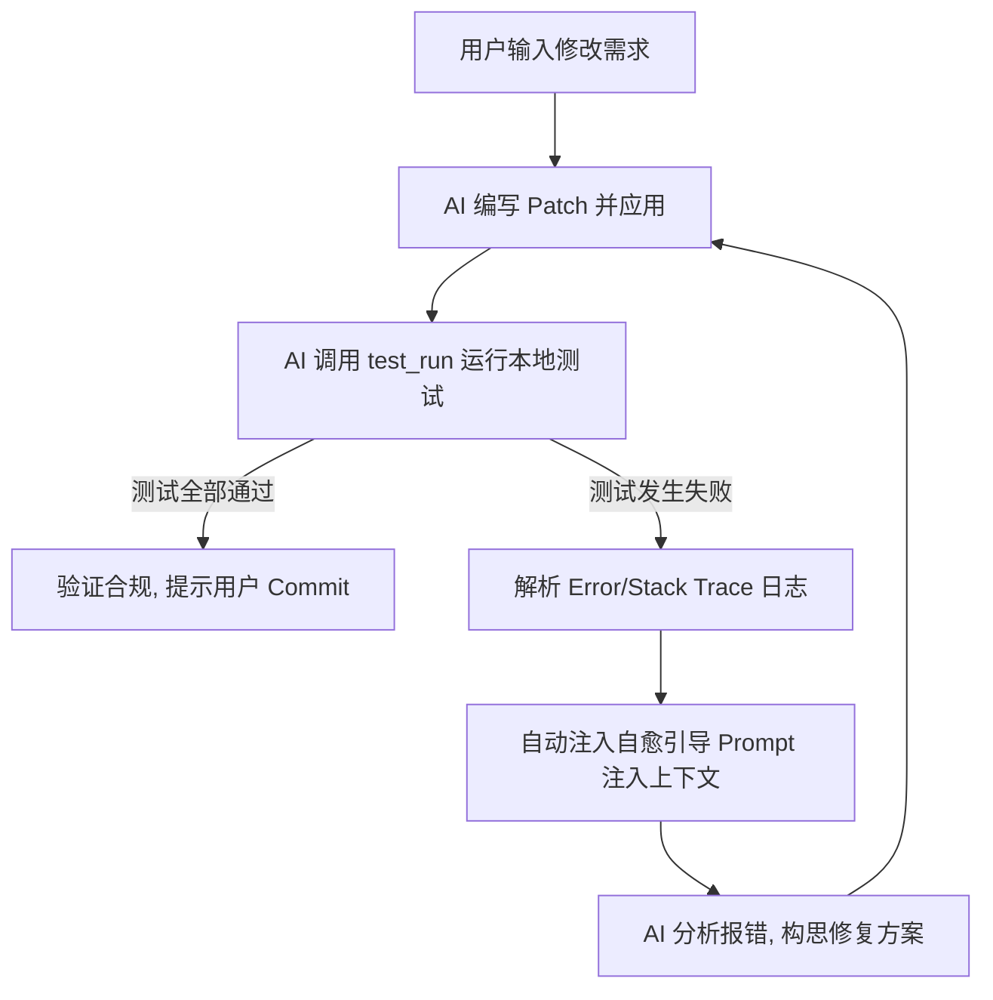

# Chaos Code 统一使用手册 (Usage Manual)

本手册详细介绍了 **Chaos Code (Spec + Test Driven AI Copilot)** 的核心概念、工作流阶段、命令行工具、交互式终端（REPL）、Model Context Protocol (MCP) 以及各种高级功能的配置与使用。

---

## 目录
1. [核心概念与工作流](#1-核心概念与工作流)
2. [环境配置与初始化](#2-环境配置与初始化)
3. [标准命令行工具参考](#3-标准命令行工具参考)
4. [交互式智能终端 (REPL) 使用指南](#4-交互式智能终端-repl-使用指南)
5. [Model Context Protocol (MCP) 接入配置](#5-model-context-protocol-mcp-接入配置)
6. [自愈测试与修复环 (Self-Healing Loop)](#6-自愈测试与修复环-self-healing-loop)
7. [项目健康诊断与配置定制](#7-项目健康诊断与配置定制)
8. [高级多智能体 (Multi-Agent) 与并行控制](#8-高级多智能体-multi-agent-与并行控制)

---

## 1. 核心概念与工作流

Chaos Code 以规范（Spec）与测试（Test）为核心，将所有的代码变更抽象为 **Change (变更)**。每一次开发活动都由 AI 驱动并受到“STDD 宪法”的约束。

### 1.1 核心概念
*   **Spec (规格说明)**：位于 `stdd/specs/` 下的 Markdown 文件，明确定义了需求、接口契约和验收条件。代码修改前，规格必须先明确。
*   **Change (变更)**：位于 `stdd/changes/<change-name>/` 下的一组文件。每个变更包含一个 `tasks.md`（任务清单）以及所产生的测试证据。
*   **STDD Constitution (宪法)**：包含一系列交付规则。例如：所有公共函数必须有 JSDoc 注释、不允许遗留硬编码 Secrets、测试覆盖率必须达标、修改前必须编写/运行测试（红绿重构）等。

### 1.2 Ralph Loop 工作流阶段
每次开发都遵循以下 8 个严格的生命周期阶段：
1.  **inspect (检索)**：分析项目代码库及当前变更状态。
2.  **propose (提案)**：明确变更范围与需求。
3.  **spec (规格化)**：生成或更新 spec 规格文档。
4.  **plan (规划)**：在 `tasks.md` 中拆解详细任务清单。
5.  **patch (修补)**：AI 编写代码并以补丁（unified diff）形式应用到源码中。
6.  **test (测试)**：运行配置的单元测试并收集执行证据。
7.  **verify (验证)**：执行 STDD 宪法门禁审计（代码规范、漏洞扫描、测试通过率）。
8.  **summarize (总结)**：记录交付报告并将变更归档（archive）。

---

## 2. 环境配置与初始化

### 2.1 完整安装与部署

#### 2.1.1 本地依赖安装
克隆好 Chaos Code 源代码仓库到本地后，首先进入根目录下安装全部 Node.js 运行期所依赖的包：
```bash
git clone https://github.com/Marcher-lam/chaos-code.git
cd chaos-code
npm install
```

#### 2.1.2 全局链接 CLI 命令 (重要推荐)
要在任意项目文件夹下直接使用 `chaos` 或 `stdd` 命令，需将此克隆库全局链接到系统中。
在 `chaos-code` 根目录内执行：
```bash
# 全局挂载（如果在 Mac/Linux 遇到写入权限错误，请添加 sudo 前缀）
npm link
```
链接建立后，系统将自动创建如下的全局软链：
*   `chaos` -> 指向 `cli.js` 主运行脚本
*   `stdd` -> 指向 `cli.js` 主运行脚本 (兼容别名)

您可以在任何其它项目目录下，直接调用 `chaos --help` 调出命令行助手，或者直接键入 `chaos` 进入交互终端。

### 2.2 环境变量配置

Chaos Code 根据环境变量来获取 LLM 密钥和配置网络接入：

```bash
# OpenAI 兼容 API 配置
export OPENAI_API_KEY="sk-..."
export STDD_LLM_BASE_URL="https://api.openai.com/v1" # 自定义转发端点
export OPENAI_MODEL="gpt-4o-mini"                   # 默认模型

# Anthropic API 配置
export ANTHROPIC_API_KEY="sk-ant-..."
export ANTHROPIC_MODEL="claude-3-5-sonnet-latest"    # 默认模型

# 统一 LLM 覆盖变量 (高优先级)
export STDD_LLM_API_KEY="your-api-key"
export STDD_LLM_MODEL="your-chosen-model"
```

### 2.2 项目初始化
在需要接入 Chaos Code 的项目根目录中执行：

```bash
node cli.js init
```
该命令会在项目根目录自动创建 `stdd/` 文件夹及默认配置文件 `stdd/config.yaml`。

---

## 3. 标准命令行工具参考

Chaos Code 提供了丰富的子命令用于非交互式的 CI 流程或单步骤控制。

### 3.1 基础管理命令
*   `chaos init [path]`：初始化当前或指定路径的项目。
*   `chaos list` (或 `chaos ls`)：列出所有活跃的变更。
*   `chaos status [change-name]`：展示指定变更的流程状态与当前的门禁检查情况。
*   `chaos doctor`：对项目进行健康检查，排查配置缺失、预挂钩（Hooks）异常或文件破坏。

### 3.2 变更生命周期命令
*   `chaos new change <change-name>`：创建一个新的活跃变更目录与任务清单。
*   `chaos ff <description>`：快速生成带有预填充任务的任务变更（Fast-Forward 模式）。
*   `chaos turbo <description>`：一键跑通前置的所有静态解析与规格生成阶段。
*   `chaos apply [change-name]`：执行当前活跃任务的下一个待办任务项，自动修改代码。
*   `chaos verify [change-name]`：运行宪法与测试套件校验，确保随时可交付。
*   `chaos archive [change-name]`：将验证通过的变更文件移动到归档目录 `stdd/changes/archive/`。

### 3.3 质量与规范命令
*   `chaos guard`：执行核心合规审计检查。
*   `chaos metrics [change-name]`：查看当前变更关联的测试覆盖率与代码度量数据。
*   `chaos constitution check`：单步对工作区进行宪法合规性扫描。
*   `chaos constitution fix`：自动修复一些常见的违宪项目（例如缺失的 JSDoc 或格式错误）。

---

## 4. 交互式智能终端 (REPL) 使用指南

这是 Chaos Code 类似 Claude Code 的核心体验。通过在项目根目录运行无参数的命令来拉起交互式 Shell：

```bash
node cli.js
```

### 4.1 终端特点
*   **完全自主的上下文环境**：你可以像和普通 AI 对话一样在提示符 `chaos > ` 后面键入自然语言指令，如 `“修复 __tests__/my-code.test.js 中的失败用例并提交”`。
*   **操作审批拦截器**：当 AI 判定需要写入、修补文件、执行测试或调用 Git 操作时，终端会停顿并展示红色/黄色警告，要求用户显式确认授权（输入 `y/n`）。
*   **会话内斜杠命令（Slash Commands）**：

| 斜杠命令 | 参数 | 用例与功能描述 |
| :--- | :--- | :--- |
| `/help` | 无 | 显示终端斜杠命令的统一列表与基础帮助。 |
| `/status` | 无 | 打印出当前的 STDD 活跃变更名、当前的阶段（如 patch/test）以及相关计数统计。 |
| `/diff` | 无 | 展示工作区未提交的文件状态，并在终端中预览统一补丁补丁预览。 |
| `/commit` | 无 | 暂存所有工作区修改，并弹出交互提示请求输入 Commit Message 完成提交。 |
| `/rollback` | 无 | 强制丢弃本地工作区所有未提交的修改（执行 `git reset --hard`）。 |
| `/model` | `[model_name]` | 不带参数时查看当前使用的 LLM 模型；带参数时立即在会话中切换模型。 |
| `/cost` | 无 | 打印本会话累积消耗的 Token 用量（提示词/补全词）以及估算累计折算美分费用。 |
| `/session` | 无 | 展示当前会话的元数据，包括运行时间、LLM 提供商名称、当前模型及上下文列表。 |
| `/compact` | 无 | 智能对聊天历史记录进行截断压缩，删除冗长的旧工具返回数据，节省 Token 上下文。 |
| `/reset` | 无 | 彻底清空当前会话的上下文记录，开启全新的对话交互。 |
| `/clear` | 无 | 清除屏幕。 |
| `/exit` | 无 | 退出交互式终端（快捷键为 `ctrl+d`）。 |

---

## 5. Model Context Protocol (MCP) 接入配置

Model Context Protocol (MCP) 允许大语言模型使用标准化接口发现并调用外部工具。Chaos Code 内置了 MCP 客户端，可以反射调用系统中的任何 MCP 服务。

### 5.1 配置服务
在工作区创建一个配置文件 `stdd/mcp-servers.json`：

```json
{
  "mcpServers": {
    "gitserver": {
      "command": "node",
      "args": ["/Users/user/.nvm/versions/node/v20.11.0/bin/mcp-server-git"]
    },
    "mysql": {
      "command": "npx",
      "args": ["-y", "@modelcontextprotocol/server-postgres", "postgresql://localhost/mydb"]
    }
  }
}
```

### 5.2 动态反射与前缀解析
启动 Chaos Code 时，它会自动在后台拉起上述定义的服务，通过标准 I/O 完成 JSON-RPC 握手并拉取工具列表。
*   工具注册：工具会自动加上服务名前缀。例如，`gitserver` 服务的 `create_branch` 工具在 Chaos Code 中会反射为大模型可调用的 `gitserver_create_branch` 函数。
*   安全限制：所有的 MCP 外部工具默认分配为 `risk: 'write'` 风险等级，在执行前必须在交互终端中得到用户的输入确认。

---

## 6. 自愈测试与修复环 (Self-Healing Loop)

Chaos Code 具有强大的代码编写及修复自动纠错闭环：



### 6.1 自愈日志解析
在 `test_run` 执行失败后，AI 会拿到过滤后的堆栈信息，包含发生错误的测试断言、代码行数和异常类别，随后自动唤醒修复模式重新执行 Patch 写入，直到代码通过测试。

---

## 7. 项目健康诊断与配置定制

### 7.1 配置文件说明
`stdd/config.yaml` 包含了控制规范与行为的全部选项：

```yaml
# 核心配置
mode: strict            # strict 严格执行门禁模式, loose 宽松开发模式
defaults:
  model: gpt-4o-mini    # 默认使用的核心模型
  
# 自动测试配置
test:
  command: npm run test # 测试运行命令
  coverage_threshold: 80 # 期望的代码覆盖率百分比
  
# linter 合规工具选择
linter:
  tool: eslint          # 可选 eslint, prettier, standard

# 宪法检查门禁
constitution:
  enforce_jsdoc: true   # 是否强制为导出的公共 API 编写 JSDoc 注释
  block_secrets: true   # 阻止提交包含潜在 API Key 等密钥的代码
```

---

## 8. 高级多智能体 (Multi-Agent) 与并行控制

在复杂开发任务中，可以使用 Chaos Code 提供的并行与多智能体路由能力。

### 8.1 并行流水线任务
```bash
chaos parallel run "lint-and-format"
```
根据 DAG 任务依赖定义，在进程中并发调度多个子模块构建活动。

### 8.2 Supervisor 协调模式
当开启复杂重构时，可以运行主管模式，拉起多个独立的子 Agent：
```bash
chaos supervisor start --agents research,patcher,tester
```
*   `research` 负责在后台无损阅读和检索；
*   `patcher` 负责生成并验证差异代码；
*   `tester` 在沙箱中执行断言验证与监控。
三个子 Agent 在同一个工作区中分工协作，降低主上下文的污染。

---

## 9. 附录：常用命令范例 (Appendix: Common Command Examples)

以下是 Chaos Code 的一些常用命令范例，供查阅与测试对齐：

```bash
# 初始化与变更管理
chaos init /path/to/project
chaos init --force
chaos new change add-dark-mode
chaos status add-dark-mode

# 列表与状态
chaos list --specs
chaos list --archived
chaos list --json
chaos skills
chaos commands

# 宪法门禁与预挂钩
chaos constitution show 2
chaos hooks install
chaos hooks verify
chaos hooks status
chaos hooks disable
chaos hooks enable
```

