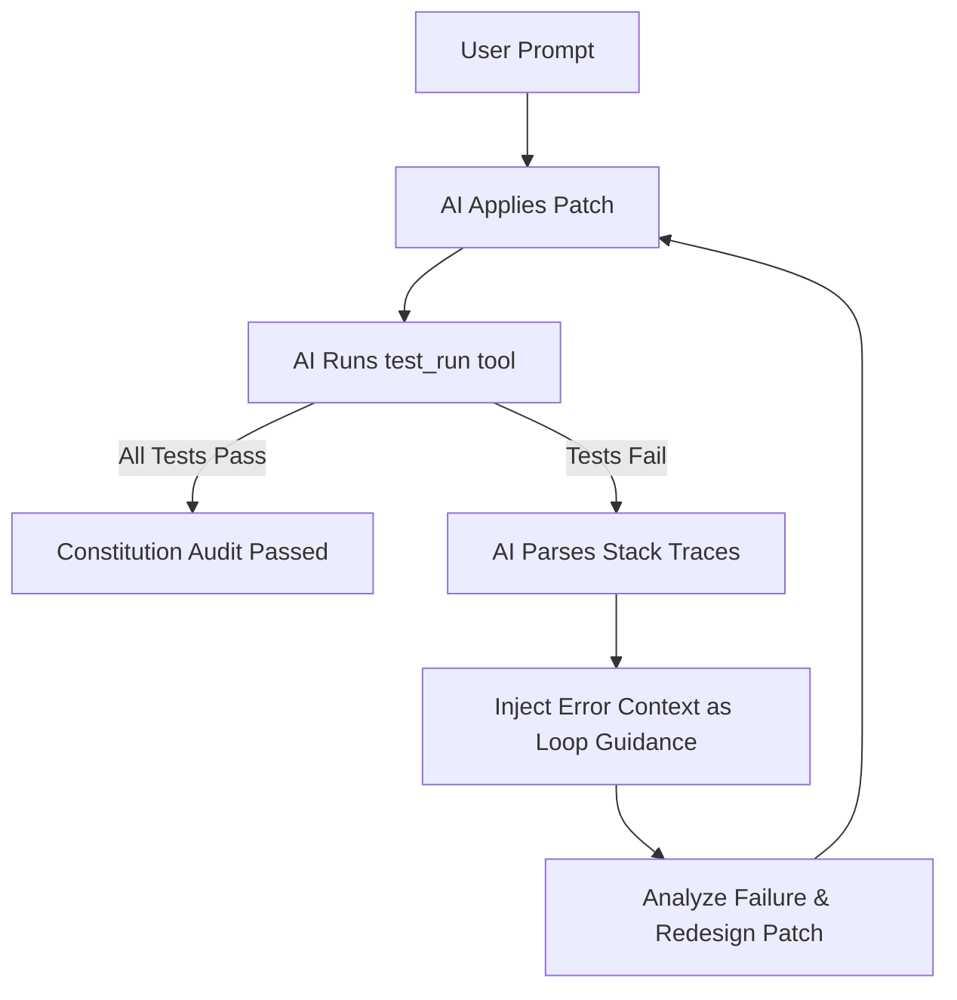

# Chaos Code Unified Usage Manual

This manual provides a detailed guide on the core concepts, workflow phases, CLI reference, Interactive Terminal (REPL), Model Context Protocol (MCP) integration, and advanced functionalities of **Chaos Code (Spec + Test Driven AI Copilot)**.

---

## Table of Contents
1. [Core Concepts & Workflow](#1-core-concepts--workflow)
2. [Environment Setup & Initialization](#2-environment-setup--initialization)
3. [CLI Reference](#3-cli-reference)
4. [Interactive Terminal (REPL) Guide](#4-interactive-terminal-repl-guide)
5. [Model Context Protocol (MCP) Integration](#5-model-context-protocol-mcp-integration)
6. [Self-Healing Test-and-Repair Loop](#6-self-healing-test-and-repair-loop)
7. [Diagnostics & Configuration Customization](#7-diagnostics--configuration-customization)
8. [Advanced Multi-Agent & Parallel Workflows](#8-advanced-multi-agent--parallel-workflows)

---

## 1. Core Concepts & Workflow

Chaos Code is structured around Specifications (Specs) and Tests, abstracting all features and bug fixes into **Changes**. Every modification is driven by the AI kernel and monitored under the project's **STDD Constitution**.

### 1.1 Core Concepts
*   **Spec**: Markdown documents in `stdd/specs/` defining requirements, API contracts, and success criteria. Specs must be defined before code alterations begin.
*   **Change**: Located in `stdd/changes/<change-name>/`. Each change includes a `tasks.md` TODO checklist and stored test execution evidence.
*   **STDD Constitution**: A set of coding compliance rules. Examples: all exported public APIs must have JSDoc comments, no hardcoded secrets, test coverage thresholds must be met, and tests must be run before final integration.

### 1.2 Ralph Loop Workflow Phases
Every implementation iteration flows through these 8 lifecycle phases:
1.  **inspect**: Scan workspace files and check existing change registry state.
2.  **propose**: Clarify intent, scope, and target files.
3.  **spec**: Create or update the specs file.
4.  **plan**: Generate a checklist of modular steps inside `tasks.md`.
5.  **patch**: AI writes unified diff patches and applies them to sources.
6.  **test**: Execute configured tests and record the run output as evidence.
7.  **verify**: Check code compliance, security guidelines, and test results.
8.  **summarize**: Generate delivery reports and archive completed changes.

---

## 2. Environment Setup & Initialization

### 2.1 Detailed Installation & Global Setup

#### 2.1.1 Clone and Install Dependencies
Clone the Chaos Code repository and run npm install inside the repository root to download dependencies:
```bash
git clone https://github.com/Marcher-lam/chaos-code.git
cd chaos-code
npm install
```

#### 2.1.2 Globally Link the CLI Tool (Highly Recommended)
To run the `chaos` or `stdd` commands directly from **any directory** on your workstation, map them globally by creating a symlink.
Inside the cloned `chaos-code` root folder, run:
```bash
# Link the CLI scripts to global bin (prepend sudo on macOS/Linux if you encounter write permission issues)
npm link
```
This maps the following commands globally:
*   `chaos` -> points to `cli.js`
*   `stdd` -> points to `cli.js` (compatibility alias)

After establishing the link, open any new shell and type `chaos --help` or simply run `chaos` to start the interactive REPL.

### 2.2 Environment Variables

Chaos Code reads credentials and API routing details from your environment variables:

```bash
# OpenAI Configuration
export OPENAI_API_KEY="sk-..."
export STDD_LLM_BASE_URL="https://api.openai.com/v1" # Optional custom proxy/endpoint
export OPENAI_MODEL="gpt-4o-mini"                   # Default model choice

# Anthropic Configuration
export ANTHROPIC_API_KEY="sk-ant-..."
export ANTHROPIC_MODEL="claude-3-5-sonnet-latest"    # Default model choice

# Override Key & Model (Highest Priority)
export STDD_LLM_API_KEY="your-api-key"
export STDD_LLM_MODEL="your-model-name"
```

### 2.2 Project Initialization
Run the initialization wizard in your project root:

```bash
node cli.js init
```
This generates the `stdd/` folder, preset folders (`specs`, `changes`), and the configuration file `stdd/config.yaml`.

---

## 3. CLI Reference

Chaos Code offers subcommands suitable for one-off actions or CI pipelines.

### 3.1 Workspace & Health Checks
*   `chaos init [path]`: Set up Chaos Code scaffolding in the target folder.
*   `chaos list` (or `chaos ls`): Print all active and archived changes.
*   `chaos status [change-name]`: Retrieve phase indicators and compliance checklists for the active change.
*   `chaos doctor`: Scan configuration viability, hook stability, and folder integrity.

### 3.2 Change & Tasks Operations
*   `chaos new change <change-name>`: Scaffolds a new change record and task checklist.
*   `chaos ff <description>`: Fast-Forward mode. Creates a change with pre-populated task items.
*   `chaos turbo <description>`: One-shot CLI option executing the inspect, propose, spec, and plan steps.
*   `chaos apply [change-name]`: Process the next pending task in `tasks.md`, applying code changes.
*   `chaos verify [change-name]`: Check tests and constitution rules to verify delivery readiness.
*   `chaos archive [change-name]`: Move completed and verified changes to `stdd/changes/archive/`.

### 3.3 Quality Gates & Constitution
*   `chaos guard`: Runs all linter and test gate audits.
*   `chaos metrics [change-name]`: View current change-level code coverage statistics.
*   `chaos constitution check`: Audit the codebase for compliance violations.
*   `chaos constitution fix`: Perform automated hot-fixes for JSDoc formatting and hook corrections.

---

## 4. Interactive Terminal (REPL) Guide

Launch the interactive REPL shell by calling the script without positional parameters:

```bash
node cli.js
```

### 4.1 Features
*   **Autonomous Agent Loop**: Prompt the AI directly (e.g. `"Fix the failing tests in __tests__/util.test.js and commit"`). The loop processes files and executes commands automatically.
*   **Streaming Markdown Rendering**: AI responses stream in real-time with syntax highlighting (12+ languages), table alignment, bold/italic/links, and full Markdown rendering.
*   **Tab Completion**: Three-layer smart completion: `/` prefix matches slash commands, `/model ` matches model names, `./` `../` `~/` matches file paths.
*   **Multi-line Input**: Type `"""` or ``` to enter multi-line mode. Supports unclosed bracket/quote detection. Submit with an empty line.
*   **Dynamic Prompt**: Shows current git branch (dirty marker `*`) and active model name, e.g., `main*:gpt-4o > `.
*   **Real-time Tool Display**: Structured box display when AI calls tools (tool name + args summary + timer). Streaming tool name detection shows spinner immediately.
*   **Write Approval Gates**: Any operations modifying workspace contents show a colorized diff preview and prompt for confirmation (`y/n/a/s`, `s` saves to config permanently).
*   **Auto-compact**: Automatically compresses context when it exceeds 80k tokens, preserving original goal and recent messages.
*   **Per-turn Summary**: Shows `── 3.2s · 1.2k tok · $0.0034 ──` after each turn (timing/tokens/cost).
*   **REPL Commands (Slash Commands)**:

| Slash Command | Parameter | Function |
| :--- | :--- | :--- |
| `/help` | None | Lists available slash commands. |
| `/status` | None | Displays current change name, TDD phase, and task stats. |
| `/diff` | None | Shows unstaged diffs and prints unified patches. |
| `/commit` | None | Prompts for a message, stages all files, and commits them. |
| `/rollback` | None | Performs `git reset --hard` to discard current changes. |
| `/undo` | `[file\|all]` | Revert recently patched files. `/undo` shows list, `/undo <file>` reverts specific file, `/undo all` reverts all. |
| `/model` | `[model_name]` | Prints active model, or switches model dynamically. |
| `/models` | None | List all available models from the current provider. |
| `/providers` | None | List all configured providers and their status. |
| `/connect` | None | Interactive provider setup (API key, base URL, model). |
| `/cost` | None | Displays prompt/completion tokens consumed and estimated session cost. |
| `/session` | None | Shows detailed session state, provider information, and model tags. |
| `/config` | `[key] [value]` | View/edit persistent config. Supports `set`, `permission`, `reset` subcommands. |
| `/compact` | None | Compresses chat history context to conserve token limits. |
| `/history` | `[keyword]` | Search cross-session persistent command history. |
| `/resume` | None | List and restore previously saved sessions. |
| `/export` | None | Export conversation to a Markdown file. |
| `/verbose` | `[0-2]` | Set output verbosity: 0=minimal, 1=normal, 2=verbose. |
| `/reset` | None | Wipes conversation history and starts a clean session. |
| `/clear` | None | Clears terminal screen log. |
| `/exit` | None | Shuts down REPL terminal safely. |

---

## 5. Model Context Protocol (MCP) Integration

Chaos Code supports Model Context Protocol (MCP) to let AI agents run verified external tool extensions over standard IO processes.

### 5.1 Configuring Servers
Write configuration items in `stdd/mcp-servers.json`:

```json
{
  "mcpServers": {
    "gitserver": {
      "command": "node",
      "args": ["/Users/user/.nvm/versions/node/v20.11.0/bin/mcp-server-git"]
    },
    "mysql": {
      "command": "npx",
      "args": ["-y", "@modelcontextprotocol/server-postgres", "postgresql://localhost/mydb"]
    }
  }
}
```

### 5.2 Tool Naming & Permissions
On boot, Chaos Code spawns the specified command blocks and registers target endpoints.
*   **Prefix Mapping**: Imported tools are mapped into prompt functions with prefixes, e.g., `mysql` server's `query` becomes `mysql_query`.
*   **Security Permission**: MCP tools that read/write resources outside of standard safe boundaries are classified with write risks, prompting for user confirmation before running.

---

## 6. Self-Healing Test-and-Repair Loop

Chaos Code features a self-correcting development loop:



### 6.1 Failure Analysis
In cases where tests fail during `test_run`, stdout logs are fed back into the context, prompting the model to identify code gaps and apply targeted fixes via `fs_patch` until all assertions pass.

---

## 7. Diagnostics & Configuration Customization

### 7.1 Configuration Options
Manage parameters in `stdd/config.yaml`:

```yaml
mode: strict            # strict enforces compliance checks, loose skips gates
defaults:
  model: gpt-4o-mini    # standard model tag selection

test:
  command: npm run test # execution testing script command
  coverage_threshold: 80 # expected coverage percentage target

linter:
  tool: eslint          # eslint / prettier / standard linter selection

constitution:
  enforce_jsdoc: true   # require JSDocs on exported methods
  block_secrets: true   # scan files for hardcoded API keys
```

---

## 8. Advanced Multi-Agent & Parallel Workflows

For larger restructuring tasks, Chaos Code offers parallel workflows and multi-agent coordination.

### 8.1 Parallel Pipeline Runs
Execute multiple sub-actions concurrently:
```bash
chaos parallel run "lint-and-format"
```

### 8.2 Supervisor Orchestration
To coordinate multiple AI subprocess agents:
```bash
chaos supervisor start --agents research,patcher,tester
```
*   `research`: Inspects dependencies and files.
*   `patcher`: Generates code modifications.
*   `tester`: Evaluates testing evidence.
This isolates complex responsibilities, keeping token usage under control.

---

## 9. Appendix: Common Command Examples

Here are some common command examples for quick reference and test mapping:

```bash
# Setup & Change Operations
chaos init /path/to/project
chaos init --force
chaos new change add-dark-mode
chaos status add-dark-mode

# List & Info
chaos list --specs
chaos list --archived
chaos list --json
chaos skills
chaos commands

# Constitution & Hooks
chaos constitution show 2
chaos hooks install
chaos hooks verify
chaos hooks status
chaos hooks disable
chaos hooks enable
```

