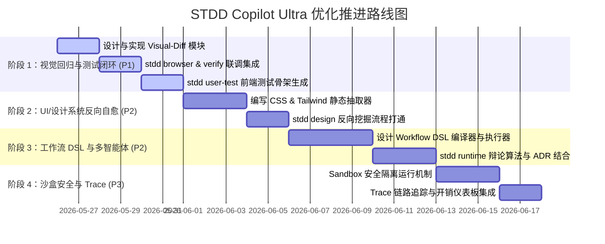

# STDD Copilot Ultra 四大维度系统性优化实施计划

本计划旨在全面落实“前端质量测试闭环”、“UI/设计系统反向自愈”、“工作流 DSL 化与智能体协同”和“测试沙盒与可观测性可追溯性”四大维度的优化目标，全面升级平台作为 AI 软件工程操作系统的架构水准。

---

## 1. 总体实施阶段规划

由于四大维度的改造体量庞大，我们将采取**分阶段推进、增量合并、全量回归**的研发策略：



---

## 2. 阶段 1 实施细节：前端质量与测试闭环 (当前执行阶段)

### 2.1 引入 `visual-regression.js` 核心模块 [NEW]
* **目标**：实现页面截图的比对与分析。
* **物理位置**：`file:///Users/marcher/Desktop/stdd-copliot-ultra/src/utils/visual-regression.js`
* **关键能力**：
  - 基于 Node.js（引入 `pixelmatch` 或利用 Playwright 内置的 `screenshot` 比对）。
  - 支持 Baseline 基准管理：`stdd/evidence/visual/baselines/`。
  - 生成视觉差异比对图：`stdd/evidence/visual/diffs/`。
  - 提供 `compareScreenshots(baselinePath, currentPath)` API，计算并返回视觉差异率（Diff Ratio）。

### 2.2 扩展 `browser.js` 命令 [MODIFY]
* **物理位置**：`file:///Users/marcher/Desktop/stdd-copliot-ultra/src/cli/commands/browser.js`
* **变更点**：
  - 新增 `stdd browser compare <url> [--name <snapshot-name>] [--threshold <ratio>]`：对指定 URL 截图并与 Baseline 比对。
  - 新增 `stdd browser update-baseline <url> [--name <snapshot-name>]`：更新或初始化基准视觉截图。

### 2.3 升级 `verify.js` 命令与质量门禁 [MODIFY]
* **物理位置**：`file:///Users/marcher/Desktop/stdd-copliot-ultra/src/cli/commands/verify.js`
* **变更点**：
  - 在全宪法合规检查中，引入**视觉宪法校验（Visual Constitution Gate）**。
  - 如果项目配置了 `stdd/config.yaml` 中的视觉检测路由，在 verify 时自动拉起 Playwright 截图，比对 Diff Ratio。
  - 视觉差异超过容忍度（如 1%）时判定为 **Blocking 阻断**，强制阻止变更归档，要求人类进行确认（waive 或更新 baseline）。

### 2.4 升级 `user-test.js` 以自动生成前端测试骨架 [MODIFY]
* **物理位置**：`file:///Users/marcher/Desktop/stdd-copliot-ultra/src/cli/commands/user-test.js`
* **变更点**：
  - 新增 `--framework react|vue|vanilla` 选项。
  - 解析 BDD `.feature` 文件，针对每一个 Scenario 自动编译并输出 React Testing Library (RTL) 或 Playwright End-to-End Spec 的测试桩代码（Stubs），实现“规格直接映射组件测试”。

---

## 3. 阶段 2 实施细节：UI/设计系统反向自愈

### 3.1 引入 `css-extractor.js` 样式编译器 [NEW]
* **物理位置**：`file:///Users/marcher/Desktop/stdd-copliot-ultra/src/utils/css-extractor.js`
* **职责**：
  - 扫描指定目录下的 `.css`、`.scss`、`tailwind.config.js`，通过正则表达式和简单的 AST 分类器，抓取核心 CSS 变量和排版样式。
  - 智能分类出：主要/次要/辅助色彩、字体层级、圆角半径、间距梯度和阴影值。

### 3.2 升级 `design.js` 命令 [MODIFY]
* **物理位置**：`file:///Users/marcher/Desktop/stdd-copliot-ultra/src/cli/commands/design.js`
* **变更点**：
  - 新增 `stdd design reverse-scan [dir]`。
  - 调用 `css-extractor.js` 自动分析项目，在 `stdd/` 下动态自适应重写 `DESIGN.md`。

---

## 4. 阶段 3 实施细节：工作流 DSL 与多智能体

### 4.1 引入 `workflow-dsl-interpreter.js` [NEW]
* **物理位置**：`file:///Users/marcher/Desktop/stdd-copliot-ultra/src/utils/workflow-dsl-interpreter.js`
* **职责**：
  - 读取并解析 `stdd/workflows/*.yaml`。
  - 使用 Kahn 拓扑排序算法根据依赖关系动态编译 DAG，并将其无缝映射到 `stdd graph run` 引擎中。

### 4.2 升级 `runtime/agent-simulator.js` [MODIFY]
* **物理位置**：`file:///Users/marcher/Desktop/stdd-copliot-ultra/src/runtime/agent-simulator.js`
* **职责**：
  - 扩展 Party Mode，与 OpenAI/Claude API 或外部 AI 客户端打通，在 Phase 2 和 Phase 3 中自动触发多角色辩论，并在辩论结束后自动收敛汇总为产品方案书。

---

## 5. 阶段 4 实施细节：沙盒安全与 Trace 链路追踪

### 5.1 升级 `command-runner.js` 安全沙盒化 [MODIFY]
* **物理位置**：`file:///Users/marcher/Desktop/stdd-copliot-ultra/src/utils/command-runner.js`
* **职责**：
  - 建立 light 沙盒隔离运行策略。如果命令参数带有 `--sandbox`，限制危险二进制执行，拦截非授权的物理磁盘写指令。

### 5.2 链路追踪与仪表板优化
* **职责**：
  - 在 `progress.jsonl` 和 `evidence-ledger.jsonl` 中引入标准 TraceID 与 SpanID。
  - 在 `stdd dashboard` 中增加 Trace 耗时和 AI API 算力花销趋势看板。

---

## 6. 验证方案 (Verification Plan)

每个阶段开发完成后，我们将通过以下手段保障质量基线的稳固：

### 6.1 自动化测试
* 针对每个新模块（如 `visual-regression.js`、`css-extractor.js`）编写 100% 分支覆盖率的物理测试文件。
* 运行全量 Jest 校验，确保原有 191 个套件、4158 条测试用例全部通过，保持 97% 以上的整体覆盖率。
```bash
npm run lint
npm run test:all
```

### 6.2 手动集成验证
1. 在真实 Greenfield/Brownfield 测试场景中，依次执行：
   ```bash
   stdd init
   stdd design create
   stdd ui page dashboard
   stdd user-test --framework react
   stdd browser compare http://localhost:3000
   ```
2. 观察 `stdd/evidence/` 目录中是否生成结构化视觉 Diff 证据及 RTL 单元测试骨架。
