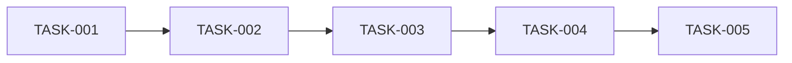

# Tasks Template

> 使用方式: 复制此模板到 `stdd/changes/{change-id}/tasks.md`

---

# Tasks: [变更标题]

> 自动生成时间: [YYYY-MM-DD HH:MM:SS]
> 基于: proposal.md, specs/, design.md

---

## Task Guidelines

- ✅ 每个任务 ≤ 30 分钟
- ✅ 任务之间有明确的依赖关系
- ✅ 任务总数 ≤ 6 个
- ✅ 遵循 TDD: 测试先行

---

## 🔴 Phase 1: Test Setup

### TASK-001: [测试基础设施任务]

**Type:** Test
**Time:** ~15 min
**Depends on:** -

**Description:**
[描述需要创建的测试基础设施]

**Acceptance Criteria:**
- [ ] 测试文件创建
- [ ] 失败测试编写
- [ ] 测试可运行

**Files:**
- `tests/__tests__/[feature].test.ts` (CREATE)

---

## 🟢 Phase 2: Implementation

### TASK-002: [核心实现任务]

**Type:** Implementation
**Time:** ~20 min
**Depends on:** TASK-001

**Description:**
[描述核心功能实现]

**Acceptance Criteria:**
- [ ] 所有测试通过
- [ ] 代码符合规范
- [ ] 类型检查通过

**Files:**
- `src/[module]/[file].ts` (CREATE/MODIFY)

---

### TASK-003: [扩展功能任务]

**Type:** Implementation
**Time:** ~15 min
**Depends on:** TASK-002

**Description:**
[描述扩展功能]

**Acceptance Criteria:**
- [ ] 扩展功能实现
- [ ] 新增测试通过

**Files:**
- `src/[module]/[file].ts` (MODIFY)

---

## 🔵 Phase 3: Refinement

### TASK-004: [重构优化任务]

**Type:** Refactor
**Time:** ~10 min
**Depends on:** TASK-003

**Description:**
[描述需要重构的代码]

**Acceptance Criteria:**
- [ ] 代码质量提升
- [ ] 测试仍然通过
- [ ] 不新增业务功能代码

**Files:**
- `src/[module]/[file].ts` (MODIFY)

---

## 🧪 Phase 4: Quality Gates

### TASK-005: [质量检查任务]

**Type:** Quality
**Time:** ~10 min
**Depends on:** TASK-004

**Description:**
[描述质量检查项]

**Checklist:**
- [ ] 静态检查通过
- [ ] 类型检查通过
- [ ] 变异测试通过
- [ ] 覆盖率达标

---

## 📋 Progress Tracking

---

## 📊 Summary

| Metric | Value |
|--------|-------|
| Total Tasks | 5 |
| Estimated Time | ~70 min |
| Test Tasks | 1 |
| Implementation Tasks | 2 |
| Refactor Tasks | 1 |
| Quality Tasks | 1 |

---

## ✅ Completion Checklist

Before marking all tasks complete:

- [ ] 所有测试通过
- [ ] 覆盖率 ≥ 80%
- [ ] 无 TypeScript 错误
- [ ] 无 ESLint 警告
- [ ] 变异测试通过
- [ ] 代码已审查

---

> Generated by Chaos Code
> Template Version: 1.0
