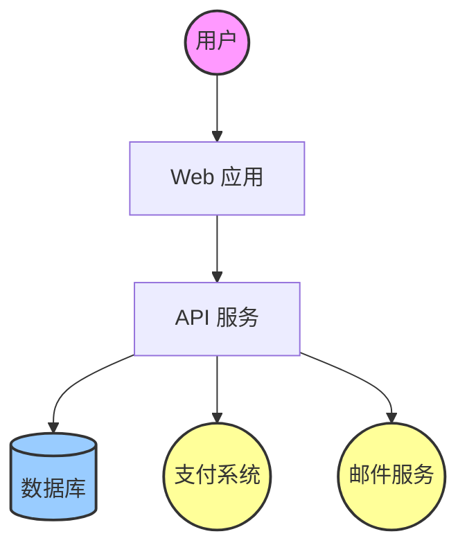
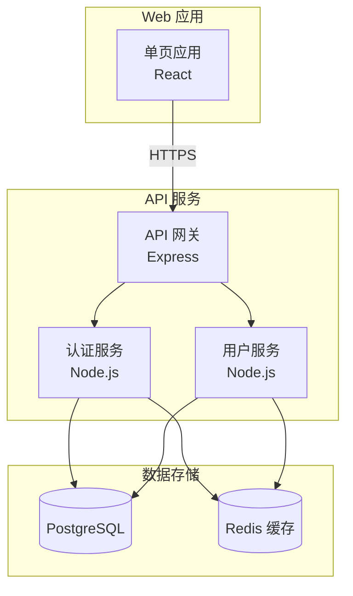
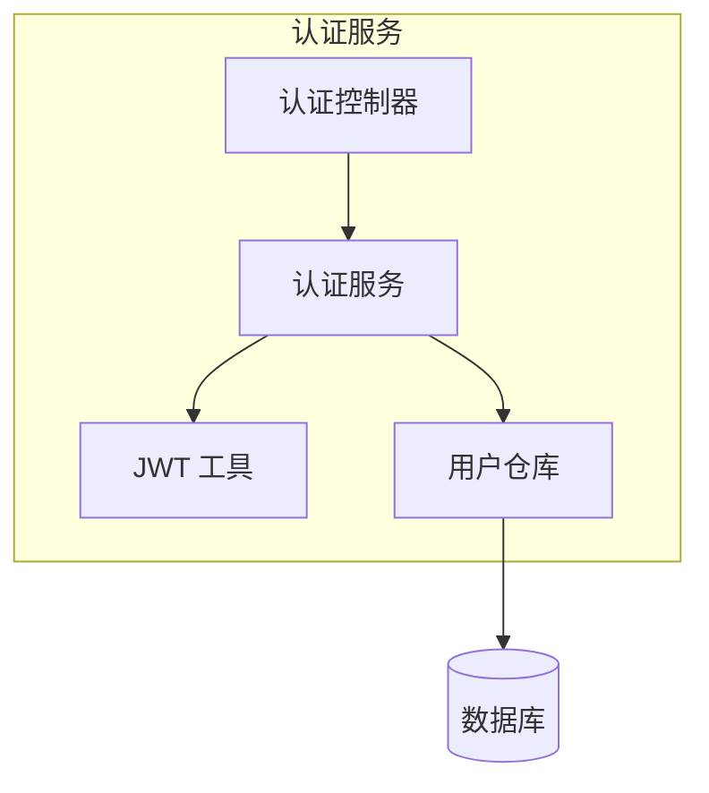
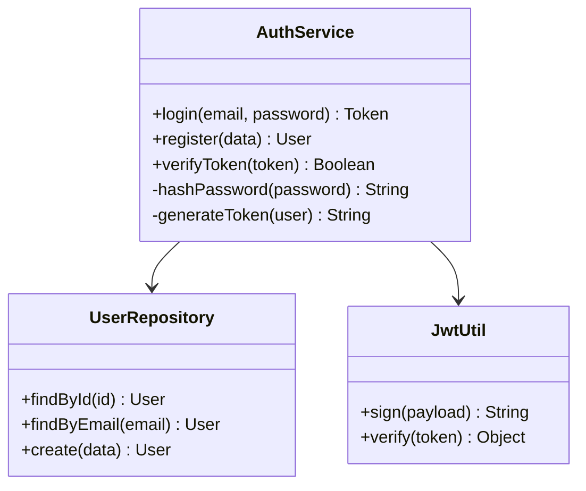
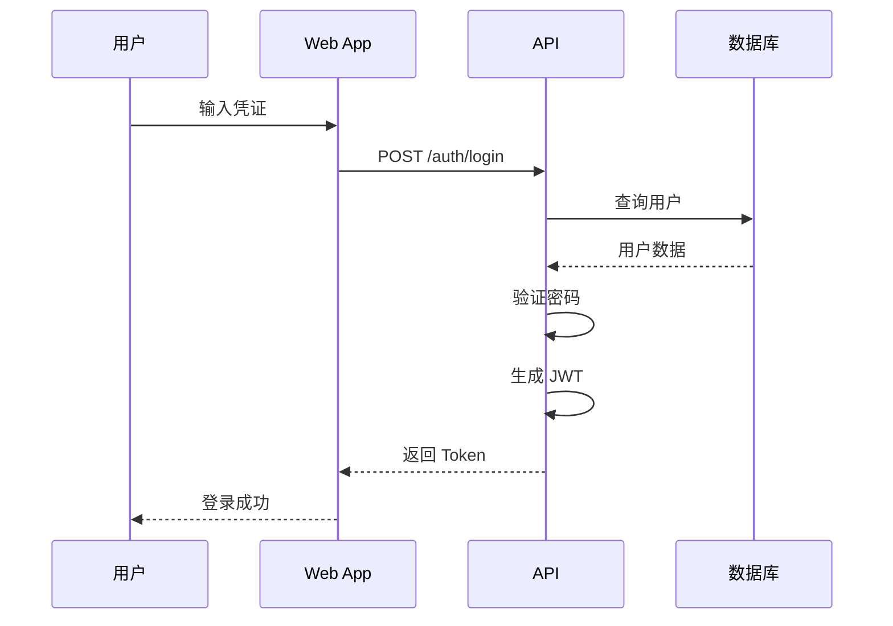
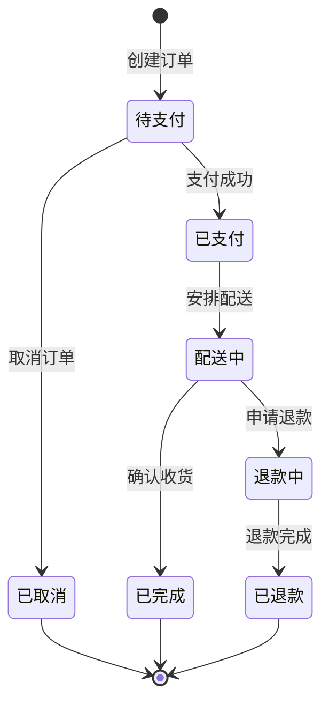
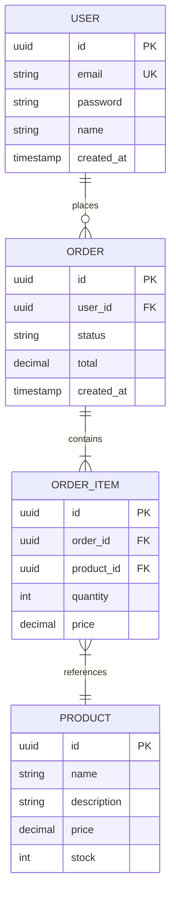
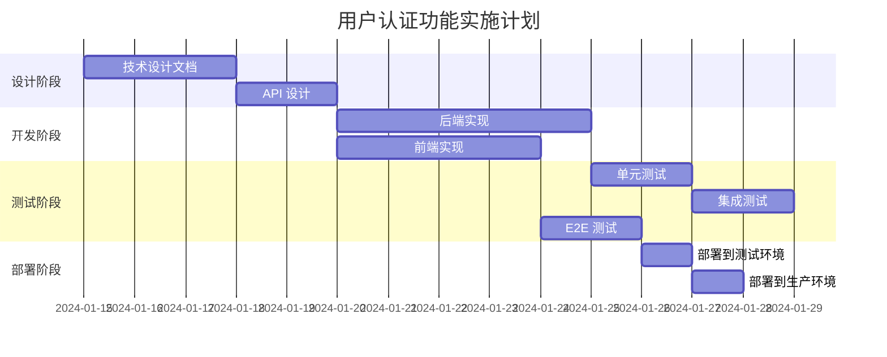

# STDD Skill: /stdd:design

## Purpose
**技术设计文档与视觉系统生成**。这是 Chaos Code 的设计 skill，支持技术设计文档（TDD）和视觉设计系统两种模式。

**核心设计原则：**
- **语言无关**：适用于任何技术栈
- **双模式**：技术设计 + 视觉系统
- **Spec 驱动**：从 specs 生成设计
- **可追溯**：设计决策记录为 ADR

## When to Use
- 需要编写技术设计文档时
- 需要定义视觉设计系统时
- 需要记录架构决策时
- 需要规划测试策略时

## 两种模式

### 模式 1: 技术设计文档 (Technical Design)

**位置**: `stdd/changes/<change-id>/design.md`

**内容**:
- 架构概述
- 组件设计
- 数据模型
- API 设计
- 风险分析
- 测试策略

**CLI**:
```bash
chaos design <change-id>

# 最小化设计
chaos design <change-id> --minimal

# 包含 ADR
chaos design <change-id> --adr
```

### 模式 2: 视觉设计系统 (Visual Design System)

**位置**: `DESIGN.md` (项目根目录)

**内容**:
- 颜色系统
- 字体排版
- 间距规则
- 组件库
- 响应式设计

**CLI**:
```bash
# 生成视觉设计系统
chaos design --visual

# 使用预设模板
chaos design --visual --preset modern
chaos design --visual --preset dark
chaos design --visual --preset minimal

# 指定 workspace
chaos design --visual --workspace packages/web
```

## 技术设计文档结构

### 1. 架构概述
```markdown
## Architecture Overview

### System Context
- External dependencies
- Data flow
- Integration points

### Component Architecture
- Service boundaries
- Module responsibilities
- Communication patterns
```

### 2. 数据模型
```markdown
## Data Models

### Entities
- User
- Session
- Permission

### Relationships
- User 1:N Session
- Role N:N Permission

### Storage
- Database schema
- Caching strategy
```

### 3. API 设计
```markdown
## API Design

### Endpoints
- POST /auth/login
- GET /users/:id
- PUT /users/:id

### Contracts
- Request schemas
- Response schemas
- Error codes
```

### 4. 风险分析
```markdown
## Risks

### Technical Risks
| Risk | Impact | Mitigation |
|------|--------|------------|
| JWT secret泄露 | High | 使用环境变量 |
| Session fixation | Medium | 定期轮换 |

### Operational Risks
- Performance under load
- Single point of failure
```

### 5. 测试策略
```markdown
## Test Strategy

### Unit Tests
- Service layer
- Utility functions
- Target: 80% coverage

### Integration Tests
- API endpoints
- Database interactions
- External services

### E2E Tests
- Critical user flows
- Authentication
- Checkout process
```

## 视觉设计系统结构

### 颜色系统
```markdown
## Colors

### Primary
- Primary: #0066CC
- Primary Dark: #004C99
- Primary Light: #3385DD

### Semantic
- Success: #10B981
- Warning: #F59E0B
- Error: #EF4444
- Info: #3B82F6

### Neutral
- Gray 50-900 scale
```

### 字体排版
```markdown
## Typography

### Font Family
- Sans: Inter, system-ui, sans-serif
- Mono: JetBrains Mono, monospace

### Type Scale
- H1: 48px / 48px
- H2: 36px / 40px
- H3: 24px / 32px
- Body: 16px / 24px
- Small: 14px / 20px
```

### 间距系统
```markdown
## Spacing

### Scale
- xs: 4px
- sm: 8px
- md: 16px
- lg: 24px
- xl: 32px
- 2xl: 48px
```

## ADR (Architecture Decision Record)

### ADR 格式
```markdown
# ADR-001: 选择 JWT 作为认证方案

## Status
Accepted

## Context
需要为 API 添加用户认证功能...

## Decision
使用 JWT (JSON Web Token) 进行认证...

## Consequences
### Positive
- 无状态、可扩展
- 跨域友好

### Negative
- Token 撤销复杂
- Payload 大小限制
```

## CLI Runtime

```bash
# 技术设计
chaos design <change-id>
chaos design <change-id> --minimal
chaos design <change-id> --adr
chaos design <change-id> --workspace packages/api

# 视觉设计系统
chaos design --visual
chaos design --visual --preset modern
chaos design --visual --preset dark
chaos design --visual --preset minimal
chaos design --visual --workspace packages/web

# 更新现有设计
chaos design <change-id> --update
chaos design --visual --update
```

## Graph Semantics
- 节点 ID 为 stdd.design，由 frontmatter 暴露给 Skill Graph。
- checkpoint=per-change；resumable=true；parallelizable=false。
- 依赖 spec，完成后进入 plan。

## Constitution Gates
- **Warning 条例 1**: Library-First - 设计应优先使用成熟库
- **Warning 条例 4**: Code Style - 设计应遵循代码规范
- **Warning 条例 6**: Error Handling - 设计应包含错误处理策略

## Evidence Contract
- 设计文档写入 `stdd/changes/<change-id>/design.md`
- ADR 写入 `stdd/changes/<change-id>/adr/`
- 视觉设计系统写入 `DESIGN.md`

## Related Skills
- **stdd.spec** - 生成规格
- **stdd.plan** - 生成任务计划
- **stdd.architecture** - 架构分析（如果存在）

## 参考资源

### 技术设计
- [Software Architecture Document Template](https://www.arc30.com/templates/arc42/)
- [Architecture Decision Records](https://adr.github.io/)
- [C4 Model for Architecture](https://c4model.com/)

### 设计系统
- [Design Systems Handbook](https://www.designsystems.com/)
- [Material Design](https://material.io/design)
- [Ant Design](https://ant.design/)

## C4 Model 架构图

### Level 1: System Context


### Level 2: Container


### Level 3: Component


### Level 4: Code


## Mermaid 图表示例

### 序列图 - 用户登录流程


### 状态图 - 订单状态


### ER 图 - 数据模型


### 甘特图 - 实施计划


## Structurizr 风格描述

### Workspace 定义
```typescript
// Structurizr workspace
{
  "name": "My Application",
  "description": "用户管理系统",
  "model": {
    "people": ["用户"],
    "softwareSystems": [{
      "name": "用户管理系统",
      "containers": [
        {
          "name": "Web 应用",
          "description": "React 单页应用",
          "technology": "React, TypeScript"
        },
        {
          "name": "API 服务",
          "description": "RESTful API",
          "technology": "Node.js, Express"
        },
        {
          "name": "数据库",
          "description": "PostgreSQL 数据库",
          "technology": "PostgreSQL 14"
        }
      ]
    }]
  },
  "views": {
    "systemContext": {
      "scope": "用户管理系统",
      "description": "系统上下文图"
    },
    "container": {
      "scope": "用户管理系统",
      "description": "容器图"
    }
  }
}
```

## arc42 模板

### 完整 arc42 结构
```markdown
# 设计文档 - 用户认证系统

## 1. 引言
### 1.1 需求概述
实现用户认证功能，支持邮箱密码登录和 JWT Token 认证。

### 1.2 质量目标
- 安全性：密码加密存储
- 性能：登录响应 < 200ms
- 可用性：99.9% SLA

## 2. 约束条件
- 使用 JWT 无状态认证
- 遵循 OWASP 安全标准
- 支持 HTTPS

## 3. 系统上下文
### 3.1 业务上下文
用户通过 Web 应用登录系统，系统验证后返回访问令牌。

### 3.2 技术上下文
- 前端：React SPA
- 后端：Node.js API
- 数据库：PostgreSQL

## 4. 构建策略
### 4.1 技术栈
- 语言：TypeScript
- 框架：Express
- 认证：JWT
- 加密：bcrypt

### 4.2 分层架构
- 表现层：React Components
- API 层：Express Routes
- 业务层：Services
- 数据层：Repositories

## 5. 运行时架构
### 5.1 组件图
[Mermaid 组件图]

### 5.2 序列图
[Mermaid 序列图]

## 6. 架构决策
### ADR-001: 选择 JWT
[详细 ADR 内容]

### ADR-002: 选择 bcrypt
[详细 ADR 内容]

## 7. 风险与热点
### 7.1 技术风险
| 风险 | 影响 | 缓解措施 |
|------|------|----------|
| Token 泄露 | 高 | 短有效期 + 刷新机制 |
| 暴力破解 | 中 | 速率限制 |

### 7.2 热点
- 密码验证：CPU 密集
- Token 生成：需要安全随机数

## 8. 质量场景
### 8.1 性能
- 登录请求：p95 < 200ms
- Token 验证：p95 < 10ms

### 8.2 安全
- 密码：bcrypt 加密
- Token：RS256 签名

## 9. 测试策略
[测试策略详细内容]
```

## 设计决策

### 为什么分离两种模式？
- **关注点分离**: 技术设计 vs 视觉设计
- **目标受众不同**: 开发者 vs 设计师
- **文件位置不同**: 变更目录 vs 项目根

### 为什么需要 ADR？
- **决策追溯**: 记录重要架构决策
- **知识传承**: 新成员理解设计意图
- **变更管理**: 评估决策变更影响

### 为什么从 specs 生成？
- **需求驱动**: 设计基于实际需求
- **一致性**: 设计与规格保持一致
- **可验证**: 设计可回溯到规格

### 为什么使用 C4 Model？
- **分层清晰**: 从上下文到代码的四个层次
- **易于理解**: 不同层次关注不同细节
- **业界标准**: 广泛采用的架构描述方法

### 为什么使用 Mermaid？
- **文本即图**: 用 Markdown 描述图表
- **版本控制友好**: 图表随代码一起版本化
- **多平台支持**: GitHub/GitLab 等平台原生支持
